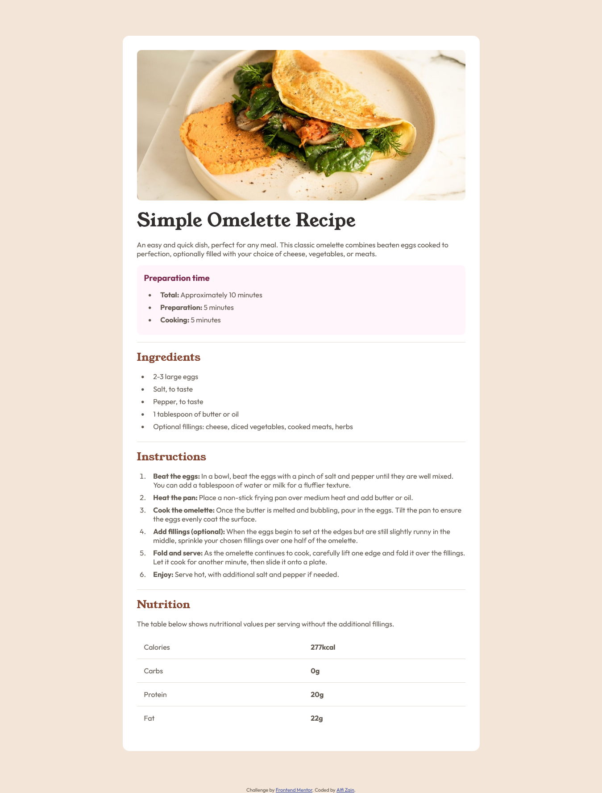

# Frontend Mentor - Recipe page solution

This is a solution to the [Recipe page challenge on Frontend Mentor](https://www.frontendmentor.io/challenges/recipe-page-KiTsR8QQKm). Frontend Mentor challenges help you improve your coding skills by building realistic projects.

## Table of contents

- [Overview](#overview)
  - [Screenshot](#screenshot)
  - [Links](#links)
- [My process](#my-process)
  - [Built with](#built-with)
  - [What I learned](#what-i-learned)
- [Author](#author)

## Overview

### Screenshot



### Links

- Live Site URL: [https://alfizain.github.io/recipe-page/](https://alfizain.github.io/recipe-page/)

## My process

### Built with

- Semantic HTML5 markup
- CSS
- Flexbox

### What I learned

```css
table {
  width: 100%;
  border-collapse: collapse;
}
tr:last-child td,
tr:last-child th {
  border-block-end: none;
}
```

## Author

- Website - [Muhammad Alfi Zain](https://alfizain.github.io/AlfiZain/)
- Frontend Mentor - [@AlfiZain](https://www.frontendmentor.io/profile/AlfiZain)
